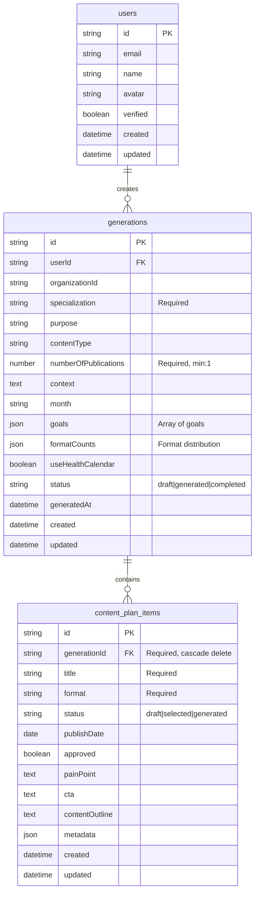

# 📊 Схема базы данных PocketBase

## Диаграмма структуры



## Описание коллекций

### 👤 `users` (Системная коллекция)

Встроенная коллекция PocketBase для управления пользователями.

**Основные поля:**
- `email` - Email пользователя (уникальный)
- `verified` - Подтверждён ли email
- `name` - Имя пользователя
- `avatar` - URL аватара

**Аутентификация:**
- Email/Password
- OAuth2 (Google, Facebook и др.)

---

### 📝 `generations`

Хранит информацию о генерациях контент-планов.

**Ключевые поля:**

| Поле | Тип | Описание |
|------|-----|----------|
| `specialization` | Text | Медицинская специализация (обязательное) |
| `month` | Text | Месяц планирования (Janeiro, Fevereiro и т.д.) |
| `goals` | JSON | Массив целей: ["Conversão", "Autoridade"] |
| `formatCounts` | JSON | Распределение форматов: `{reels: 6, carrossel: 10, ...}` |
| `numberOfPublications` | Number | Общее количество публикаций |
| `useHealthCalendar` | Bool | Использовать календарь здоровья |
| `status` | Select | Статус: draft / generated / completed |

**Пример данных:**
```json
{
  "id": "abc123xyz",
  "userId": "user_001",
  "specialization": "Odontologia",
  "month": "Janeiro",
  "goals": ["Conversão", "Autoridade"],
  "formatCounts": {
    "reels": 6,
    "carrossel": 10,
    "postEstatico": 5,
    "stories": 15,
    "liveCollab": 2
  },
  "numberOfPublications": 38,
  "useHealthCalendar": true,
  "status": "generated"
}
```

**Индексы:**
- `userId` - Быстрый поиск генераций пользователя
- `status` - Фильтрация по статусу
- `created` - Сортировка по дате создания

**Правила доступа:**
- **List/View**: Только аутентифицированные пользователи
- **Create**: Только аутентифицированные пользователи
- **Update/Delete**: Только владелец генерации

---

### 📱 `content_plan_items`

Хранит отдельные посты в контент-плане.

**Ключевые поля:**

| Поле | Тип | Описание |
|------|-----|----------|
| `generationId` | Relation | Связь с generations (обязательное) |
| `title` | Text | Заголовок поста (обязательное) |
| `format` | Text | Формат: Reels, Carrossel и т.д. (обязательное) |
| `painPoint` | Text | Болевая точка аудитории |
| `contentOutline` | Text | Структура контента |
| `cta` | Text | Call to Action |
| `publishDate` | Date | Планируемая дата публикации |
| `approved` | Bool | Одобрен ли пост |
| `status` | Select | Статус: draft / selected / generated |
| `metadata` | JSON | Дополнительные данные |

**Пример данных:**
```json
{
  "id": "item_001",
  "generationId": "abc123xyz",
  "title": "5 Sinais de que você precisa de um check-up odontológico",
  "format": "Carrossel",
  "painPoint": "Medo de descobrir problemas dentários graves",
  "contentOutline": "Slide 1: Introdução\nSlide 2-6: 5 sinais\nSlide 7: CTA",
  "cta": "Agende sua avaliação gratuita!",
  "publishDate": "2025-01-20",
  "approved": false,
  "status": "draft",
  "metadata": {
    "estimatedReach": 5000,
    "targetAudience": "adultos 25-45"
  }
}
```

**Индексы:**
- `generationId` - Быстрая загрузка всех постов генерации
- `status` - Фильтрация по статусу
- `publishDate` - Сортировка по дате публикации

**Правила доступа:**
- **List/View/Create/Update/Delete**: Только аутентифицированные пользователи

**Cascade Delete:**
При удалении генерации автоматически удаляются все связанные посты.

---

## Связи между коллекциями

### One-to-Many: User → Generations
Один пользователь может создать множество генераций.

```typescript
// Получить все генерации пользователя
const generations = await pb.collection('generations').getList(1, 50, {
  filter: `userId = "${userId}"`,
  sort: '-created'
});
```

### One-to-Many: Generation → Content Plan Items
Одна генерация содержит множество постов.

```typescript
// Получить все посты генерации
const items = await pb.collection('content_plan_items').getList(1, 50, {
  filter: `generationId = "${generationId}"`,
  expand: 'generationId'
});
```

---

## Типы данных в TypeScript

### Интерфейсы PocketBase

```typescript
// lib/pocketbase-types.ts

export interface PBGeneration extends PocketBaseRecord {
  userId?: string;
  organizationId?: string;
  specialization: string;
  purpose?: string;
  contentType?: string;
  numberOfPublications: number;
  context?: string;
  month?: string;
  goals?: string[];
  formatCounts?: string;
  useHealthCalendar?: boolean;
  status: 'draft' | 'generated' | 'completed';
  generatedAt?: string;
}

export interface PBContentPlanItem extends PocketBaseRecord {
  generationId: string;
  title: string;
  format: string;
  status: 'draft' | 'selected' | 'generated';
  publishDate?: string;
  approved: boolean;
  painPoint?: string;
  cta?: string;
  contentOutline?: string;
  metadata?: string;
}
```

---

## Миграция данных

Если у вас уже есть данные в другой БД, используйте скрипт миграции:

```typescript
// scripts/migrate-to-pocketbase.ts
import { getPocketBase } from '../lib/pocketbase';

async function migrate() {
  const pb = getPocketBase();
  
  // Миграция генераций
  for (const oldGen of oldGenerations) {
    const generation = await pb.collection('generations').create({
      userId: oldGen.user_id,
      specialization: oldGen.specialization,
      numberOfPublications: oldGen.number_of_publications,
      status: 'completed'
    });
    
    // Миграция постов
    for (const oldItem of oldGen.items) {
      await pb.collection('content_plan_items').create({
        generationId: generation.id,
        title: oldItem.title,
        format: oldItem.format,
        status: oldItem.status
      });
    }
  }
}
```

---

## Real-time Subscriptions

PocketBase поддерживает real-time обновления через WebSocket:

```typescript
// Подписка на изменения генераций
pb.collection('generations').subscribe('*', (e) => {
  console.log('Event:', e.action); // create, update, delete
  console.log('Record:', e.record);
});

// Подписка на конкретную генерацию
pb.collection('generations').subscribe(generationId, (e) => {
  console.log('Generation updated:', e.record);
});

// Отписка
pb.collection('generations').unsubscribe();
```

---

## Производительность

### Индексы

Все критичные поля проиндексированы для быстрого поиска:
- Foreign keys (`userId`, `generationId`)
- Поля для фильтрации (`status`)
- Поля для сортировки (`created`, `publishDate`)

### Пагинация

Всегда используйте пагинацию для больших списков:

```typescript
const result = await pb.collection('generations').getList(1, 20, {
  sort: '-created'
});

console.log(result.page);       // 1
console.log(result.perPage);    // 20
console.log(result.totalItems); // 150
console.log(result.totalPages); // 8
```

---

## Backup и восстановление

### Автоматический backup

PocketBase хранит данные в папке `pb_data`. Для backup:

```bash
# Создать backup
tar -czf pb_backup_$(date +%Y%m%d).tar.gz pb_data/

# Восстановить backup
tar -xzf pb_backup_20250205.tar.gz
```

### Экспорт в JSON

```bash
# Через Admin UI: Settings → Export collections
# Или через API
curl -X GET 'http://localhost:8090/api/collections' \
  -H 'Authorization: YOUR_ADMIN_TOKEN' > collections_backup.json
```

---

## Безопасность

### API Rules

Все коллекции защищены правилами доступа:

```javascript
// Только владелец может редактировать свои генерации
@request.auth.id != "" && userId = @request.auth.id

// Только аутентифицированные пользователи могут читать
@request.auth.id != ""
```

### CORS

Настройте CORS в PocketBase для вашего домена:

```bash
./pocketbase serve --origins="https://yourdomain.com"
```

---

## Полезные ссылки

- [PocketBase Documentation](https://pocketbase.io/docs/)
- [JavaScript SDK](https://github.com/pocketbase/js-sdk)
- [API Rules Guide](https://pocketbase.io/docs/api-rules-and-filters/)
- [Real-time Subscriptions](https://pocketbase.io/docs/api-realtime/)
